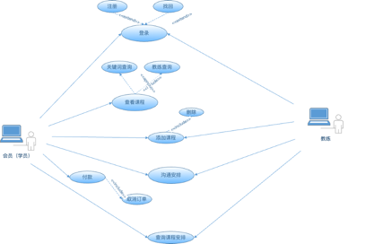
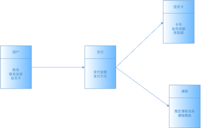
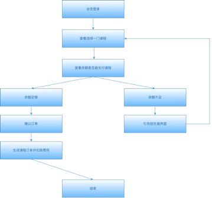
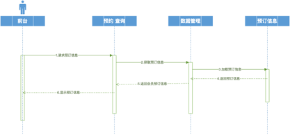
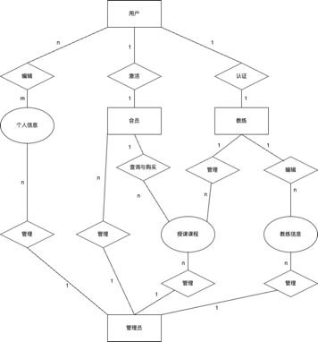
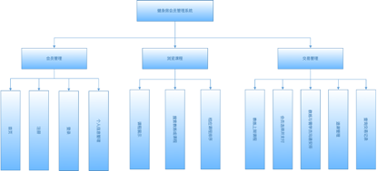

# 健身房会员管理系统

## 1. 项目介绍

### 1.1 项目背景

随着人们对健康和身体健美的重视，健身房成为了许多人日常生活的一部分。同时，随着健身行业的迅速发展，健身房的运营管理也日益复杂化。传统的会员管理、课程安排和费用结算方式已经无法满足现代健身房运营的需要，尤其是在大型连锁健身房中，需要更高效、更智能的管理系统来保证运营的顺利进行。
FitManage项目应运而生，目的是为健身房提供一个全面、高效和用户友好的会员管理系统。通过此系统，健身房可以更好地管理会员信息、课程安排、预订、费用结算等多个方面，同时为会员提供更便捷、更个性化的服务。此外，系统的安全性和权限控制设计也能确保所有数据的安全，减少运营风险。
FitManage系统将覆盖用户管理、会员登记、会员卡管理、健身课程管理、课程预订、费用结算、用户界面设计、安全性和权限控制、通知和提醒以及日志记录等多个模块。每个模块都经过精心设计，以满足健身房运营的实际需求和会员的使用体验。
项目的开发团队将基于前期收集和分析的详细需求，采用先进的开发技术和工具，按照项目计划和标准，逐步实现系统的设计、开发和测试，以期为健身房提供一个可靠、高效的会员管理解决方案，助力健身房的日常运营和服务提升。

### 1.2 项目目标

1. 高效的会员管理:实现快速准确的会员信息录入、查询和更新功能，简化健身房员工的日常管理工作，同时提高会员信息管理的准确性和效率。
2. 智能的课程管理和预订系统:提供一套完善的课程管理和预订系统，使健身房能够高效地安排课程、管理教练资源，同时为会员提供便捷的课程预订体验。
3. 安全可靠的数据保护:采用先进的数据加密和访问控制技术，确保所有用户数据和交易信息的安全，减少数据泄露和非法访问的风险。
4. 灵活的费用结算和支付系统:开发一套多功能的费用结算和支付系统，支持多种支付方式，简化费用结算流程，提高收款效率。
5. 用户友好的界面设计:设计简洁明了、易于操作的用户界面，为健身房员工和会员提供良好的使用体验，降低系统使用门槛。
6. 实时的通知和提醒功能:实现实时通知和提醒功能，及时向健身房员工和会员发送重要信息，如课程变动、会员卡续费提醒等，提升服务质量。
7. 完整的操作日志记录:开发完善的日志记录系统，记录所有关键操作和系统事件，为系统运维和问题排查提供有力支持。
8. 易于维护和升级:构建模块化、可扩展的系统架构，方便未来的功能升级和维护，保证系统的长期稳定运行。
9. 高效的项目实施和交付:按照项目计划，保质保量地完成系统的设计、开发、测试和交付，确保项目的成功实施，满足健身房的实际需求。
10. 良好的用户满意度:通过提供高效、方便、安全的会员管理服务，提高健身房的服务质量和会员满意度，增强健身房的市场竞争力。
    通过实现以上目标，FitManage项目旨在为健身房提供一个综合性的会员管理解决方案，以支持健身房的日常运营和服务提升，实现健身房的长期发展。

## 2. 项目需求分析

### 2.1 现有项目分析

1. 数据处理效率低，容易出错。
2. 缺乏自动化功能，导致人力资源浪费。
3. 无法实时更新和共享信息，影响服务质量。
4. 缺乏安全措施，难以保护会员的私人信息。
5. 缺乏与会员的互动和通知功能，不能及时响应会员需求。

### 2.2 新系统分析

新系统的需求分析主要包括用户管理、会员登记、会员卡管理、健身课程管理、课程预订、费用结算、用户界面设计、安全性和权限控制、通知和提醒以及日志记录等模块。每个模块都旨在解决传统系统的缺点，提高健身房管理的效率和服务质量，同时保证数据的安全和准确。例如，通过自动化的会员管理和课程预订功能，可以减少人工操作，减少错误，提高会员的满意度。

#### 2.2.1 对于健身房管理人员的需求分析

1. 会员管理：简化会员信息的录入、更新和查询，以提高管理效率。
2. 课程安排：快速排课、修改课程时间和教练安排，满足不同时间段的课程需求。
3. 费用结算：自动化的费用结算和支付系统，减轻财务管理的负担。
4. 通知和提醒：自动发送课程更改或会员卡续费提醒，提高服务质量。
5. 数据安全：保护会员和健身房的数据安全，避免非法访问和数据泄露。
6. 操作日志：记录关键操作和系统事件，为问题排查和运营决策提供数据支持。

#### 2.2.2 对于大众用户的需求分析

1. 简单的注册和登录：提供便捷地注册和登录流程。
2. 查看和预订课程：方便查看课程安排和在线预订课程。
3. 个人信息管理：能够查看和修改个人信息，如联系方式和健康状况。
4. 费用查询和支付：清晰的费用明细和多种支付选项。
5. 通知和提醒：接收课程和会员卡相关的通知和提醒。
6. 用户友好的界面：直观、易于使用的用户界面，为用户提供良好的使用体验。

#### 2.2.3  新系统的功能需求

1. 用户管理：多角色用户注册、登录和个人资料管理。
2. 会员登记：会员信息录入、会员卡分配。
3. 会员卡管理：新卡办理、挂失、解挂、升级等操作。
4. 健身课程管理：课程信息添加、编辑、删除及查看。
5. 课程预订：会员课程预订、预订确认通知。
6. 费用结算：费用记录、支付、费用账单生成。
7. 用户界：用户友好的界面设计。
8. 安全性和权限控制：数据加密、权限设置。
9. 通知和提醒：发送课程提醒、会员卡续费提醒等。
10. 日志记录：操作日志记录和问题排查。

#### 2.2.4  对新系统功能需求的说明

新系统功能需求旨在为健身房和会员提供一个高效、便捷和安全的管理平台。例如，用户管理功能将帮助不同角色的用户管理个人资料，课程管理和预订功能让健身房和会员更容易安排和预订课程，费用结算功能简化了付款流程，通知和提醒功能保持健身房和会员之间的实时沟通，而日志记录和安全控制功能则确保系统的安全和稳定运行。每个功能都经过精心设计以满足具体的操作和管理需求，以期提高健身房的运营效率和会员满意度。

## 3 UML基本模型

### 3.1 用例图
[](ReadMeResources/img.png)

### 3.2 类图
[](ReadMeResources/img_1.png)

### 3.3 活动图
[](ReadMeResources/img_2.png)

### 3.4 序列图
[](ReadMeResources/img_3.png)

### 3.5 实体图
[](ReadMeResources/img_5.png)

## 4. 项目设计

### 4.1 系统架构设计
本系统使用面向对象方法进行分析和设计，在MySQL数据库上实现数据库操作。使用面向对象的Java作为开发语言，Windows 10为开发平台，能较好地实现系统开发及测试。
基本设计概念与处理流程是指在设计健身房会员管理系统时，应遵循的基本原则和处理各种操作的流程。基本设计概念包括数据的组织、存储和管理，以及系统的模块化、可扩展性和安全性等。处理流程包括用户注册、登录、课程预订、支付和通知等操作的流程设计。每个流程都应清晰明了，确保用户能够方便、快捷地完成操作，同时保证系统的稳定性和数据的安全性。通过合理的设计和流程优化，能够提高系统的效率，提升用户体验，满足健身房和会员的需求。

### 4.2 系统模块设计

[](ReadMeResources/img_4.png)

1. 会员管理模块：健身房会员管理系统的核心部分，主要负责会员的注册、登记和信息管理。它包括会员资料的录入、查询、修改和删除等功能。
2. 会员管理模块：课程模块负责健身房课程的管理和预订。它包括课程信息的添加、编辑、删除和查询功能。健身房员工可以通过这个模块安排课程、分配教练和设置课程费用。同时，会员可以查看课程时间表、预订课程和查看自己的预订记录。课程模块应该为健身房和会员提供一个清晰、易用的界面，以便快速查找和预订课程。
3. 交易管理模块：负责处理和记录会员的所有交易，包括会员卡购买、续费、课程费用支付等。该模块应能生成费用账单、记录支付信息。

### 4.3 数据库设计

1. 用户信息表，如表4-1所示：
   #### 表4-1 用户信息表(Users)
   | 编号 | 字段名称         | 数据类型        | 说明              |
      |----|--------------|-------------|-----------------|
   | 1  | user_id      | BIGINT 20   | 用户唯一标识，主键       |
   | 2  | user_name    | VARCHAR 12  | 用户名, UNIQUE     |
   | 3  | password     | VARCHAR 64  | 用户密码            |
   | 4  | UserRealName | VARCHAR 5   | 用户真名            |
   | 5  | user_phone   | VARCHAR 11  | 用户手机号码          |
   | 6  | date_birth   | DATE        | 出生日期            |
   | 7  | user_type    | VARCHAR 1   | 用户角色(管理员，会员，教练) |
   | 8  | avatar       | VARCHAR 255 | 用户头像            |
   | 9  | Sex          | VARCHAR 2   | 性别              |
   | 10 | CreateTime   | datetime    | 创建日期            |
   | 11 | update_time  | datetime    | 更新时间            |

2. 会员卡表，如表4-2所示：
   #### 表4-2 会员卡表(MemberCards)
   | 编号 | 字段名称               | 数据类型            | 说明                          |
      |----|--------------------|-----------------|-----------------------------|
   | 1  | member_card_id     | BIGINT 20       | 会员卡唯一标识，主键                  |
   | 2  | user_id            | BIGINT 20       | 用户唯一标识，外键                   |
   | 3  | avatar             | VARCHAR 255     | 用户头像                        |
   | 4  | member_fee         | DECIMAL (10, 2) | 会员余额, NOT NULL DEFAULT 0.00 |
   | 5  | member_card_status | CHAR 1          | 会员卡状态，0 未激活1 已激活2 已过期       |
   | 6  | activate_time      | DATE            | 激活日期                        |
   | 7  | expire_time        | DATE            | 过期日期                        |
   | 8  | create_time        | DATETIME        | 创建日期                        |
   | 9  | update_time        | DATETIME        | 更新日期                        |

3. 教练信息表，如表4-3所示：
   #### 表4-3 教练信息表(Coachs)
   | 编号 | 字段名称            | 数据类型        | 说明                 |
      |----|-----------------|-------------|--------------------|
   | 1  | coach_id        | BIGINT      | 教练唯一标识，主键          |
   | 2  | coach_sex       | CHAR 1      | 教练性别，0 男， 1 女， 2保密 |
   | 3  | coach_real_name | VARCHAR 10  | 教练姓名               |
   | 4  | coach_phone     | VARCHAR 11  | 教练手机号码             |
   | 5  | coach_remark    | VARCHAR 255 | 专长或授课类型            |
   | 6  | create_time     | DATETIME    | 创建日期               |
   | 7  | update_time     | DATETIME    | 更新日期               |

4. 课程表，如表4-4所示：
   #### 表4-4 课程表(Courses)
   | 编号 | 字段名称           | 数据类型          | 说明                         |
      |----|----------------|---------------|----------------------------|
   | 1  | course_id      | BIGINT 20     | 课程唯一标识，主键                  |
   | 2  | course_name    | VARCHAR 100   | 课程名称                       |
   | 3  | coach_id       | BIGINT 20     | 教练id,外键                    |
   | 4  | schedule_start | DATETIME      | 课程开始时间                     |
   | 5  | schedule_end   | DATETIME      | 课程结束时间                     |
   | 6  | course_fee     | DECIMAL(10,2) | 课程金额，NOT NULL DEFAULT 0.00 |
   | 7  | isEnrolled     | CHAR 1        | 是否已预定，0 未预定， 1 已预定         |
   | 8  | create_time    | DATETIME      | 创建日期                       |
   | 9  | update_time    | DATETIME      | 更新日期                       |

5. 预定表，如表4-5所示：
   #### 表4-5 预定表(Bookings)
   | 编号 | 字段名称                    | 数据类型      | 说明                 |
      |----|-------------------------|-----------|--------------------|
   | 1  | booking_id              | BIGINT 20 | 预定唯一标识，主键          |
   | 2  | user_id                 | BIGINT 20 | 用户唯一标识，外键          |
   | 3  | course_id               | BIGINT 20 | 课程唯一标识, 外键         |
   | 4  | booking_date            | DATETIME  | 预定日期               |
   | 5  | isEnrolledByCurrentUser | CHAR 1    | 是否为当前用户预定，0 否， 1 是 |

6. 支付表，如表4-6所示：
   #### 表4-6 支付表(Payments)
   | 编号 | 字段名称           | 数据类型          | 说明                 |
      |----|----------------|---------------|--------------------|
   | 1  | payment_id     | BIGINT 20     | 支付唯一标识，主键          |
   | 2  | UserID         | BIGINT 20     | 用户唯一标识，外键          |
   | 3  | booking_id     | BIGINT 20     | 预定唯一标识，外键          |
   | 4  | amount         | DECIMAL(10,2) | 支付金额, DEFAULT 0.00 |
   | 5  | payment_date   | DATETIME      | 支付日期               |
   | 6  | payment_type   | VARCHAR 20    | 支付方式               |
   | 7  | payment_status | CHAR 1        | 支付状态，0 未支付， 1 已支付  |

7. 日志表，如表4-7所示：
   #### 表4-7 日志表(Logs)
   | 编号 | 字段名称              | 数据类型        | 说明        |
      |----|-------------------|-------------|-----------|
   | 1  | log_id            | BIGINT 20   | 日志唯一标识，主键 |
   | 2  | user_id           | BIGINT 20   | 用户唯一标识，外键 |
   | 3  | action_type       | VARCHAR 255 | 操作类型      |
   | 4  | action_date       | DATETIME    | 操作日期      |
   | 5  | request_method    | VARCHAR 255 | 请求方法      |
   | 6  | request_data      | TEXT        | 请求参数      |
   | 7  | response_data     | TEXT        | 返回结果      |
   | 8  | exception_name    | VARCHAR 255 | 异常名称      |
   | 9  | exception_message | TEXT        | 异常信息      |
   | 10 | user_name         | VARCHAR 255 | 请求用户名称    |
   | 11 | request_uri       | VARCHAR 255 | 请求URI     |
   | 12 | request_ip        | VARCHAR 255 | 请求IP      |

这里我们只使用了物理主键来约束表结构，而不采用物理外键，并且在程序中使用逻辑外键，它能提供更大的灵活性，可以简化数据库设计和维护，但缺点是会有完整性风险，如果应用层代码有缺陷，则可能导致数据一致性问题。数据库表初始化SQL文件详见完整代码。

## 5. 项目实现及功能展示

### 5.1 登录注册

[](/ReadMeResources/img_6.png)

```vue
const login = async () => {
  try {
    await form.value.validate();
    const res = await userLoginService(formModel.value);

    if (res.data && res.data.data) {
      const { token, userType } = res.data.data;

      // 存储 token 和 userType
      userStore.setToken(token);
      userStore.setUserType(userType);

      ElMessage.success('登录成功');

      // 跳转到对应的页面
      await router.push(userType === '1' ? '/adminDashboard' : '/memberDashboard');
    }
  } catch (error) {
    console.error("登录失败:", error);
    ElMessage.error('登录失败');
  }
}
```

如果找不到该账户，则会返回账号不存在的消息给前端，前端会弹出消息框提示用户。如果密码错误，则会返回密码错误的消息。
当然，为防止用户进行撞库，仅在测试环境中，才提示具体信息。

```java
/**
 * 用户登录
 * @param userLoginDTO
 * @return
 */
@Override
public User login(UserLoginDTO userLoginDTO) {
    String username = userLoginDTO.getUserName();
    String password = userLoginDTO.getPassword();

    User user = userMapper.selectByUserName(username);

    if (user == null) {
        // 账号不存在
       throw new BaseException(MessageConstant.ACCOUNT_NOT_FOUND);
    }

    //密码加密
   password = DigestUtils.md5DigestAsHex(password.getBytes());

    //密码比对
   if (!password.equals(user.getPassword())) {
       //密码错误
      throw new BaseException(MessageConstant.PASSWORD_ERROR);
   }

   return user;
}
```

一旦用户成功登录，生成JWT令牌，每个后续请求都将包含令牌，从而允许用户访问该令牌允许的路由，服务和资源。
前端使用Pinia将该用户token存储在本地，减少每次请求对服务器的压力。同时根据用户(user_type)的类型，判断该用户为管理员亦或是会员，进行不同页面的跳转。

```java
@PostMapping("/login")
@Operation(summary = "用户登录")
@OperationLog(operDesc = "用户登录")
public Result<UserLoginVO> login(@RequestBody UserLoginDTO userLoginDTO) {
    log.info("用户登录：{}", userLoginDTO.getUserName());

    User user = userService.login(userLoginDTO);

    //登录成功后，生成jwt令牌
   Map<String, Object> claims = new HashMap<>();
   claims.put(JwtClaimsConstant.USER_ID, user.getUserId());
   String token = JwtUtil.createJWT(
           jwtProperties.getUserSecretKey(),
           jwtProperties.getUserTtl(),
           claims);

   UserLoginVO userLoginVO = UserLoginVO.builder()
           .userType(user.getUserType())
           .token(token)
           .build();

   return Result.success(userLoginVO);

    }
```

在注册界面，前端与后端都会校验用户输入的合法性，确保输入数据符合预期格式和类型，有助于保持数据库和系统的数据完整性。
无论是出于安全性、稳定性还是用户体验的考虑，这是开发过程中的一个重要环节。

[](/ReadMeResources/img_7.png)

### 5.2 管理员界面
来到管理员主界面，分为会员管理、教练管理、课程管理、订单查询、日志查询、个人中心几个大模块。
个人中心为通用组件页面，里面为用户基本资料、更换头像、重置密码。该组件所有用户都能看到。

[](/ReadMeResources/img_8.png)

用户基本资料会在登录成功后就会返回给前端，并且在点击该页面后进行渲染。

[](/ReadMeResources/img_9.png)

个人头像在数据库表中设计的为该图片的地址，如果在数据库中直接存储大型二进制数据，会导致性能下降。读取和写入数据可能会占用大量的I/O资源和处理时间，也会增加硬件需求和成本。因此这里使用阿里云的对象存储服务OSS，将该图像的外链存入数据库，链接肯定比一张图的二进制小，前端则会直接访问该外链进行回显。使用UUID防止文件重名问题。

```java
@PostMapping("/upload/avatar")
public Result<String> upload(MultipartFile file, @RequestParam("userId") Long userId) throws IOException {
   log.info("文件上传：{}", file.getOriginalFilename());

   try {
      // 获取文件名
      String originalFilename = file.getOriginalFilename();
      // UUID生成随机文件名
      String fileName = UUID.randomUUID().toString() + originalFilename.substring(originalFilename.lastIndexOf("."));
      // 上传文件
      String filePath = aliOssUtil.upload(file.getBytes(), fileName);

      // 更新用户头像
      userService.updateAvatar(userId, filePath);

      return Result.success(filePath);
   } catch (IOException e) {
      log.info("文件上传失败：{}", e.getMessage());
   }
   return Result.error(MessageConstant.UPLOAD_FAILED);
}
```


管理端会员管理、教练管理以及课程管理主要涉及一些数据库的增删改查，教练姓名将在添加课程信息时进行提示，也支持字母的模糊搜索。

[](/ReadMeResources/img_10.png)

```vue
// 根据输入查询匹配的教练姓名
const querySearch = async (queryString, cb) => {
  try {
    const response = await getCoachListService();
    const coachNames = response.data.data.map(coach => ({ value: coach.coachRealName }));
    // 过滤和搜索词匹配的结果
    const results = coachNames.filter(coach => coach.value.toLowerCase().includes(queryString.toLowerCase()));
    cb(results); // 返回结果
  } catch (error) {
    console.error('获取教练列表失败:', error);
    cb([]); // 发生错误时返回空数组
  }
}
```

日志模块方面后端使用自定义注解，在每个请求方法前添加日志自定义注解，调用切入点，记录操作日志。

[](/ReadMeResources/img_11.png)

```java
    /**
     * 设置操作日志切入点 记录操作日志 在注解的位置切入代码
     */
    @Pointcut("@annotation(com.sjdddd.annotation.OperationLog)")
    public void operLogPoinCut() {
    }

    /**
     * 正常返回通知，拦截用户操作日志，连接点正常执行完成后执行， 如果连接点抛出异常，则不会执行
     *
     * @param joinPoint 切入点
     * @param keys      返回结果
     */
    @AfterReturning(value = "operLogPoinCut()", returning = "keys")
    public void saveOperLog(JoinPoint joinPoint, Object keys) {
        // 获取RequestAttributes
        RequestAttributes requestAttributes = RequestContextHolder.getRequestAttributes();
        // 从获取RequestAttributes中获取HttpServletRequest的信息
        HttpServletRequest request = (HttpServletRequest) requestAttributes
                .resolveReference(RequestAttributes.REFERENCE_REQUEST);

        Log operlog = new Log();
        try {

            // 从切面织入点处通过反射机制获取织入点处的方法
            MethodSignature signature = (MethodSignature) joinPoint.getSignature();
            // 获取切入点所在的方法
            Method method = signature.getMethod();
            // 获取操作
            OperationLog opLog = method.getAnnotation(OperationLog.class);
            if (opLog != null) {
                String operDesc = opLog.operDesc();
                operlog.setActionType(operDesc); // 操作描述
            }
            // 获取请求的类名
            String className = joinPoint.getTarget().getClass().getName();
            // 获取请求的方法名
            String methodName = method.getName();
            methodName = className + "." + methodName;

            operlog.setRequestMethod(methodName); // 请求方法

            // 请求的参数
            Object[] arguments = joinPoint.getArgs();
            //判断参数数组是否为空
            Stream<?> stream = ArrayUtils.isEmpty(arguments) ? Stream.empty() :  Arrays.asList(arguments).stream();
            //过滤 joinPoint.getArgs()返回的数组中携带有Request或者Response对象
            List<Object> logArgs = stream
                    .filter(arg -> (!(arg instanceof HttpServletRequest) && !(arg instanceof HttpServletResponse)))
                    .collect(Collectors.toList());

            // 先将参数所在的list 转换成json 数组
            JSONArray jsonArray = JSONArray.parseArray(JSON.toJSONString(logArgs));
            //再转 json 字符串
            String params = jsonArray.toJSONString();

            operlog.setRequestData(params); // 请求参数
            operlog.setResponseData(JSON.toJSONString(keys)); // 返回结果
            User user = getUser();
            operlog.setUserId(user != null ? user.getUserId() : 0); // 请求用户ID
            operlog.setUserName(user != null ? user.getUserName() : "admin"); // 请求用户名称
            operlog.setActionDate(new Date()); // 创建时间
            operlog.setRequestIp(getIp()); // 请求IP
            operlog.setRequestUri(request.getRequestURI()); // 请求URI
            operatelogsService.save(operlog);
        } catch (Exception e) {
            e.printStackTrace();
        }
    }
```

### 5.3 会员界面

分为课程管理、账单管理以及个人中心。课程管理页面可以列出管理端所添加的课程，用户可以进行报名，退课操作。
在报名课程前，系统会对该用户的余额进行查询，如不满足该课程所需报名金额，则会跳转充值界面。
若该课程已被其他用户报名，则此用户无法进行报名，前端会显示已被预定。
用户想进行退课，会对课程开始时间检查，防止用户不合法退课。
后端部分，支付涉及多表查询插入更新操作，此处应开启事务，保证数据的一致性以及操作的原子性，一个失败就应该回滚，丢出错误信息给前端。

[](/ReadMeResources/img_12.png)

该课程被其他用户预定。

```mysql
SELECT  
    course.*,  
    coach.coach_real_name AS coachRealName,  
    # 对于每个课程，检查当前用户（userId）是否预订了该课程  
    MAX(CASE WHEN booking.user_id = #{userId, jdbcType=BIGINT}  
        # 如果是，isEnrolledByCurrentUser 设置为 1，否则为 0。  
	    THEN booking.isEnrolledByCurrentUser ELSE '0'  
	    END) AS isEnrolledByCurrentUser,  
	# 对于每个课程，检查是否有除当前用户外的其他用户预订了该课程，  
	# 并且这些预订是有效的（即 isEnrolledByCurrentUser 为 1）。  
    MAX(CASE WHEN booking.user_id != #{userId, jdbcType=BIGINT}  
	    #如果是，isEnrolledByOther 设置为 1，否则为 0。  
	        AND booking.isEnrolledByCurrentUser = '1'  
        THEN '1' ELSE '0'  
	    END) AS isEnrolledByOther  
FROM gym_courses course  
	LEFT JOIN gym_coachs coach  
        ON course.coach_id = coach.coach_id  
	LEFT JOIN gym_booking booking  
        ON course.course_id = booking.course_id  
GROUP BY course.course_id, coach.coach_real_name  
ORDER BY course.course_id  
```

账单界面可以查看用户自己的支付记录、报名课程，退课课程，支付方式金额。
